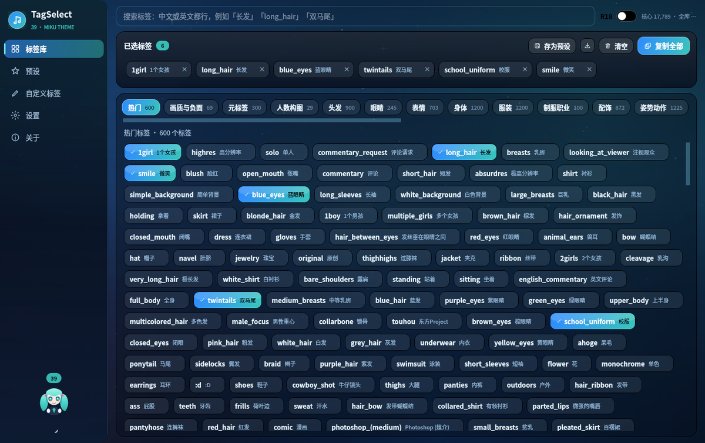
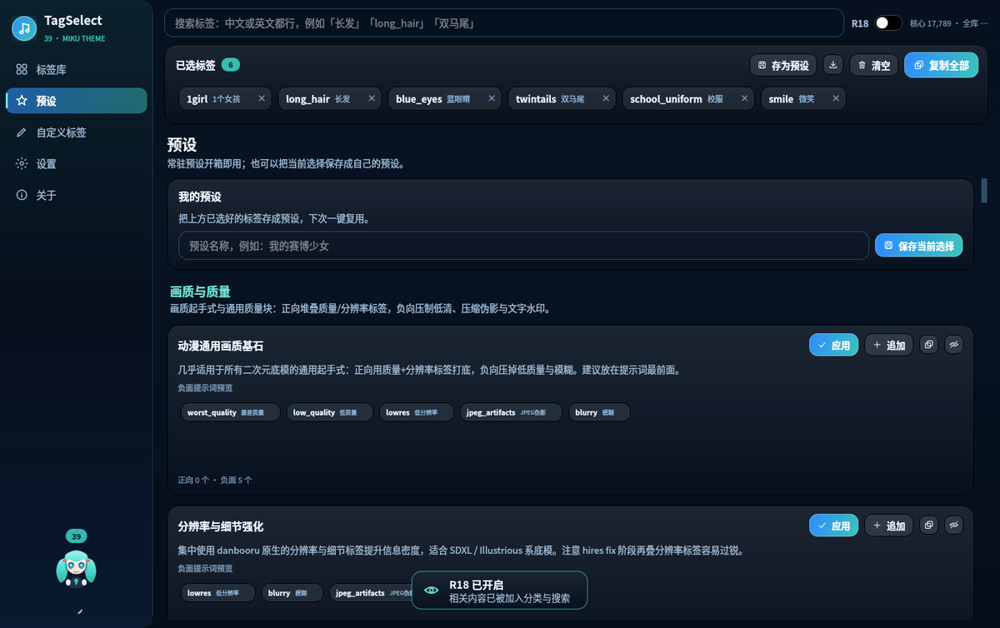

# ComfyUI_TagSelect


> 简约的 AI 生图 Tag 选择器 · 初音未来主题 · Windows 单文件 exe

把 AI 绘画常用的 tag 分门别类摆好，**点一下加入上方选择框，再点一下移出**，
最后按「**复制全部**」直接粘进 ComfyUI / NovelAI / Stable Diffusion WebUI / Illustrious / Pony。

支持 **中文搜英文**：输入「长发」就能找到 `long_hair`。

## ⬇️ 下载

**[→ 到 Releases 页面下载 `ComfyUI_TagSelect.exe`](https://github.com/Luoury/ComfyUI_TagSelect/releases/latest)**

双击即可运行，**不需要安装 Python**，约 40~60 MB。同目录的 `SHA256SUMS.txt` 可用于校验下载完整性。

> exe 由 GitHub Actions 在 `windows-latest` 上自动构建
> （[工作流](.github/workflows/build-windows.yml)），每次推送到 `main` 或打版本标签都会重新打包并上传。





> 截图使用的是内置的深蓝渐变背景 —— 本仓库**不附带壁纸图片**，
> 想换成插画主题请见 [壁纸](#壁纸)。

---

## 目录

- [功能一览](#功能一览)
- [下载](#-下载)
- [快速开始](#快速开始)
- [打包成 exe](#打包成-exe)
- [自动构建](#自动构建)
- [界面说明](#界面说明)
- [快捷键](#快捷键)
- [自定义标签与预设](#自定义标签与预设)
- [R18 开关](#r18-开关)
- [标签数据](#标签数据)
- [壁纸](#壁纸)
- [彩蛋](#彩蛋)
- [项目结构](#项目结构)
- [常见问题](#常见问题)
- [许可](#许可)

---

## 功能一览

| 需求 | 实现 |
| --- | --- |
| 分门别类的 tag | **23 个语义分类**，17,700+ 精选标签，背后可检索 19 万条全量库 |
| 参考 NovelAI / Danbooru 标签 | 数据来自 Danbooru 公开标签集（含中文翻译），并额外补充 NovelAI / SD 生态的画质与负面提示词 |
| R18 内容 + 开关（默认关闭） | 顶栏 `R18` 开关，默认关闭；关闭时 R18 分类与搜索结果全部隐藏 |
| 初音未来主题 UI | Miku 配色（`#39C5BB`）+ Q 版未来彩蛋 |
| 壁纸完全覆盖、不留白 | `KeepAspectRatioByExpanding` + 居中裁剪，任意窗口比例都铺满 |
| 主界面直接是 tag，设置放左侧栏 | 左侧侧边栏：标签库 / 预设 / 自定义标签 / 设置 / 关于 |
| tag 搜索 | 中英混合搜索，支持别名、前缀、包含、中文名匹配，按热度排序 |
| 中文搜英文 | ✅ 输入「双马尾」→ `twintails` |
| 自定义 tag | 「自定义标签」页可添加，之后能搜索、能选择，支持分组与备注 |
| 保存自定义预设 | 选择框上的「存为预设」，或预设页保存当前选择 |
| 常驻预设 | **81 个内置预设 / 8 个分组**（NovelAI「V3/V4」、SD1.5、SDXL、Pony V6 XL、Illustrious / NoobAI 的官方或社区标准质量串与负面串） |
| 点击加入 / 再次点击移除 | ✅ 被选中的 tag 显示为**蓝色渐变** |
| 复制全部 | ✅ 右上角「复制全部」（`Ctrl+Shift+C`），5 种分隔格式可选 |

---

## 快速开始

### 方式一：直接用 exe（推荐给普通用户）

到 **[Releases 页面](https://github.com/Luoury/ComfyUI_TagSelect/releases/latest)** 下载
`ComfyUI_TagSelect.exe`，双击即可，不需要安装 Python。

（如果你是自己从源码打包的，产物在 `dist\ComfyUI_TagSelect.exe`。）

### 方式二：从源码运行

先克隆仓库（标签数据已经打包在仓库里，克隆完就能跑）：

```bash
git clone https://github.com/Luoury/ComfyUI_TagSelect.git
cd ComfyUI_TagSelect
```

需要 **Python 3.10 ~ 3.12**（PyQt5 与 PyInstaller 的 wheel 最齐全）。

```bash
# Windows：双击 run.bat 即可（会自动建虚拟环境、装依赖）

# 或者手动：
python -m venv .venv
.venv\Scripts\pip install -r requirements.txt     # Windows
# source .venv/bin/activate && pip install -r requirements.txt   # Linux / macOS

python app.py
```

> **标签数据已经随仓库提供**（`assets/data/` 下的三个文件），开箱即用，不需要额外生成。
> 程序同时兼容 **PySide6**：环境里只有 PySide6 没有 PyQt5 时也能直接运行。
>
> 只有想**重新生成**标签数据时，才需要把 `supermarket.json` 和 `danbooru.csv`
> 放到 `.work/` 目录下，再执行 `python tools/build_data.py`。

---

## 打包成 exe

```bat
:: Windows —— 双击即可，会自动完成建环境、装依赖、生成数据、打包
build_exe.bat
```

产物：`dist\ComfyUI_TagSelect.exe`（单文件，约 40~60 MB，双击即用）

Linux / macOS：

```bash
./build_exe.sh          # 产物在 dist/ComfyUI_TagSelect
```

想改成「文件夹模式」（启动更快，避免每次解压）：

打开 `ComfyUI_TagSelect.spec`，把 `ONEFILE` 改成 `False`，重新执行打包命令即可。

---

## 自动构建

没有 Windows 机器也能出 exe —— 仓库带了一条 GitHub Actions 工作流
[`.github/workflows/build-windows.yml`](.github/workflows/build-windows.yml)，
在 GitHub 自己的 `windows-latest` 上完成打包并作为 Release 附件发布。

触发方式：

| 操作 | 结果 |
| --- | --- |
| push 到 `main` | 按 `cts/__init__.py` 里的 `__version__` 发布到 `vX.Y` |
| push 形如 `v1.2` 的标签 | 发布到该标签 |
| Actions 页面手动 **Run workflow** | 同第一条 |

每次构建会依次执行：

1. 检查 `assets/data/` 三个数据文件是否齐全
2. 跑 `tools/selftest.py`（离屏，53 项断言）
3. `pyinstaller ComfyUI_TagSelect.spec` 打包单文件 exe
4. 跑 `tools/smoke_test.py` —— 启动 exe 等 14 秒，确认不是秒退
5. 生成 `SHA256SUMS.txt`，把 exe 与校验和上传到对应 Release
6. 同时留一份 workflow artifact（保留 30 天）

> 关闭了 UPX 压缩：压缩后的 PyInstaller 产物经常被杀毒软件误报，不值得。

---

## 界面说明

```
┌──────────┬──────────────────────────────────────────────────────────┐
│  MIKU    │  🔍 搜索标签（中文 / 英文 / 别名）        R18 ⚪   统计     │
│  Logo    ├──────────────────────────────────────────────────────────┤
│          │  已选标签 12        [存为预设] [导出] [清空] [复制全部]   │
│ ▸ 标签库  │  ┌────────────────────────────────────────────────────┐  │
│   预设   │  │ 1girl ×  long_hair ×  smile ×  ...   ← 蓝色=已选中  │  │
│   自定义  │  └────────────────────────────────────────────────────┘  │
│   设置   ├──────────────────────────────────────────────────────────┤
│   关于   │  [热门][画质与负面][元标签][人数构图][头发][眼睛]...      │
│          │  ┌────────────────────────────────────────────────────┐  │
│  chibi   │  │ ●1girl 一个女孩  ●long_hair 长发  ●smile 微笑       │  │
│  miku    │  │ ●blue_eyes 蓝眼睛 ...            ← 单击加入/移出    │  │
│          │  └────────────────────────────────────────────────────┘  │
└──────────┴──────────────────────────────────────────────────────────┘
```

- **最上面的框**就是提示词框：点标签加入，点框里的 `×` 或再点原标签即可移出。
- 左侧栏可收起（`Ctrl+B`），收起后只剩图标。
- 右键任意标签：复制单个标签 / 以它为关键词搜索 / 加入自定义标签。

---

## 快捷键

| 快捷键 | 作用 |
| --- | --- |
| `Ctrl + F` | 聚焦搜索框 |
| `Ctrl + Shift + C` | 复制全部已选标签 |
| `Esc` | 清空搜索 / 取消聚焦 |
| `Ctrl + B` | 收起 / 展开左侧边栏 |
| `Ctrl + 1` ~ `Ctrl + 5` | 切换左侧页面 |

> 小彩蛋：在搜索框里输入 `39` 并回车，会下大葱雨 🌱

---

## 自定义标签与预设

**自定义标签**（`自定义标签` 页）

- 填英文标签（必填）+ 中文名 + 分组 + 备注，点「加入自定义标签」。
- 之后它就出现在 `自定义` 分类里，也能被搜索到、能点选。
- 右键标签库里的任意标签 →「加入自定义标签」可以快速收藏。

**预设**（`预设` 页）

- 「我的预设」：把当前选择框里的标签存成预设，一键复用。
- 「常驻预设」：8 个分组、81 个内置预设，覆盖画质、模型、画风、光影、构图、场景、角色模板、负面提示词。
- 每个预设卡片：**应用**（替换当前选择）/ **追加**（保留当前选择）/ 复制正向 / 复制负面。

数据文件位置（设置页可以一键打开）：

| 平台 | 路径 |
| --- | --- |
| Windows | `%APPDATA%\ComfyUI_TagSelect\` |
| Linux | `~/.config/ComfyUI_TagSelect/` |
| macOS | `~/Library/Application Support/ComfyUI_TagSelect/` |

想做成绿色便携版：在 exe 同目录放一个空的 `portable.txt`，数据就会写在 `userdata/` 子目录里。

---

## R18 开关

- 位于顶栏右上角，**默认关闭**。
- **关闭时**：R18 分类不出现，搜索结果中的 R18 标签也会被过滤掉。
- **打开时**：侧边栏分类列表末尾出现 `R18` 分类，搜索结果包含相关内容，开关会变成粉色。

被判定为 R18 的是**明确成人向**的标签：裸露（`nude` / `completely_nude` / `nipples` / `areola` …）、
性器官、性行为（`sex` / `fellatio` / `creampie` …）、以及束缚、露出等性癖标签。

`breasts`、`cleavage`、`thighhighs`、`underwear`、`panties`、`bikini` 这类**常见于正常向作品**的身体 / 服装标签
**不会**被隐藏 —— 否则开关一关就没法正常选图了。判定规则写在 `tools/build_data.py` 的
`R18_EXACT` / `R18_TOKENS` / `R18_GUARD` 里，可以自行增删后重新生成数据。

---

## 标签数据

| 文件 | 内容 | 大小 |
| --- | --- | --- |
| `assets/data/tags_core.json` | 精选可浏览标签，23 个分类，**17,000+** 条 | ~780 KB |
| `assets/data/tags_full.tsv.gz` | 全量检索库，**193,000+** 条（含英文别名） | ~4.2 MB |
| `assets/data/presets.json` | 81 个常驻预设 | 47 KB |

来源与生成：

- 基础数据：**Danbooru 公开标签集**（317,423 条，含中文翻译与投稿量），
  经 `tools/build_data.py` 做语义分类 + R18 判定 + 别名合并 + 画师降噪后生成。
- 画质 / 负面词条：`masterpiece`、`best_quality`、`bad_hands` 等**不是 Danbooru 标签**，
  由脚本内置的 `EXTRA_PROMPT_TAGS` 手工补充，保证选得到。
- 常驻预设：来自 NovelAI 官方文档、NoobAI / Illustrious / Pony V6 XL 模型卡与社区通用写法，
  来源清单见 `assets/data/presets_sources.md`，逐条校验报告见 `assets/data/presets_check.txt`。

重新生成（需要把 `supermarket.json` 与 `danbooru.csv` 放在 `.work/` 下）：

```bash
python tools/build_data.py
# 可指定目录：
python tools/build_data.py --input-dir /path/to/data --output-dir assets/data
```

脚本会自动分类、跑自检并打印每个分类的抽样结果。

---

## 壁纸

**本仓库不附带任何壁纸图片。**

开发时使用的几张初音未来插画来自 pixiv，版权归各画师所有，不适合在公开仓库里再分发，
因此 `assets/wallpapers/` 目录是空的（只保留一份 `README.md`）。
上面截图里的深蓝渐变**就是不带壁纸时的默认背景**，功能完全不受影响。

想换成插画主题：

1. 把任意图片（`.jpg` / `.jpeg` / `.png` / `.webp` / `.bmp`）放进 `assets/wallpapers/`；
2. 重启程序，进「设置 → 外观」即可切换，程序会自动识别目录里的所有图片；
3. 壁纸用 `KeepAspectRatioByExpanding` + 居中裁剪绘制，**任何窗口比例下都铺满、不会留白**。

> 自己重新打包 exe 时记得先放图 —— `ComfyUI_TagSelect.spec` 会把整个 `assets/` 一起打进去。

---

## 彩蛋

- 点左下角那只**小未来**（她会眨眼），会下一场**大葱雨** 🌱
- 搜索框输入 `39` 回车 —— 同样的效果。`39` 是ミク的谐音，也是她最经典的应援数字
- Logo、《关于》页的小未来会跟着节奏轻轻摇摆
- 鼠标悬停标签可以看到投稿量、中文名与 R18 标记
- 壁纸有 **5 张**，设置页可以随时切换（全部会自动铺满窗口）

---

## 项目结构

```
ComfyUI_TagSelect/
├── app.py                      # 程序入口
├── cts/                        # 主程序包
│   ├── app.py                  # QApplication 启动
│   ├── qtcompat.py             # PyQt5 / PySide6 兼容层
│   ├── theme.py                # 初音配色、字体、全局 QSS
│   ├── resources.py            # 资源路径 / 用户数据目录（含便携模式）
│   ├── data_store.py           # 标签数据库 + 全库搜索索引（后台线程加载）
│   ├── user_data.py            # 设置 / 自定义标签 / 预设 的读写
│   ├── icons.py                # QPainter 手绘线性图标
│   ├── miku_art.py             # Q 版未来、大葱、Logo 的矢量绘制
│   ├── main_window.py          # 主窗口：搜索栏 + 已选框 + 分类标签网格
│   └── widgets/
│       ├── background.py       # 壁纸全覆盖绘制
│       ├── tag_canvas.py       # 虚拟化标签画布（可承载上万标签）
│       ├── chip_paint.py       # 胶囊统一绘制（选中=蓝色渐变）
│       ├── common.py           # 玻璃卡片、胶囊按钮、开关、Toast
│       ├── sidebar.py          # 左侧导航 + Q 版未来彩蛋
│       ├── pages.py            # 预设 / 自定义标签 / 设置 / 关于
│       └── leek_rain.py        # 大葱雨彩蛋
├── assets/
│   ├── wallpapers/             # 空的（放你自己的图，见「壁纸」一节）
│   ├── icons/                  # 应用图标 (.ico / .png)
│   └── data/                   # 标签数据与预设
├── docs/                       # 文档截图
├── tools/
│   ├── build_data.py           # 标签数据生成流水线
│   ├── selftest.py             # 离屏功能自测（53 项断言）
│   ├── smoke_test.py           # 打包产物冒烟测试（启动后检查是否秒退）
│   └── screenshot.py           # 开发用离屏截图校对工具
├── .github/workflows/          # GitHub Actions：自动打包 Windows exe
├── ComfyUI_TagSelect.spec      # PyInstaller 配置
├── build_exe.bat / build_exe.sh
├── run.bat
├── requirements.txt
├── LICENSE                     # MIT
└── README.md
```

---

## 常见问题

**Q：双击 exe 没反应 / 闪退？**
A：多半是打包时缺了数据文件。确认 `assets/data/tags_core.json` 存在，然后重新执行 `build_exe.bat`。

**Q：启动比较慢？**
A：单文件 exe 每次启动都要解压到临时目录。把 `ComfyUI_TagSelect.spec` 里的 `ONEFILE` 改成 `False`
重新打包成文件夹模式，启动会快很多。

**Q：搜索某个标签搜不到？**
A：程序启动后会**后台加载全量索引**（约 0.5 秒），加载完成前只搜核心库，
右上角统计会显示「核心 17,789 · 全库 …」，变成具体数字后就代表全量库可用了。

**Q：怎么把中文标签换成我习惯的叫法？**
A：重新生成数据前，改 `tools/build_data.py` 里对应的分类词表；
或者直接在「自定义标签」页加一条同名标签覆盖显示。（同名自定义标签会覆盖原条目）

**Q：想要更多标签？**
A：调大 `tools/build_data.py` 里的 `CORE_CAPS`（每个分类的核心标签上限），重新生成即可。

**Q：界面背景是纯色的，没有插画？**
A：这是正常的 —— 仓库不附带壁纸。把自己的图片放进 `assets/wallpapers/` 就能换，详见 [壁纸](#壁纸)。

**Q：怎么确认功能都正常？**
A：跑 `python tools/selftest.py`（离屏，不需要显示器），会执行 53 项断言并打印结果。

---

## 致谢与许可

- 标签数据来自 [Danbooru](https://danbooru.donmai.us/) 公开标签库，中文翻译与别名来自社区整理的数据集。
- 常驻预设参考 [NovelAI 官方文档](https://docs.novelai.net/en/image/qualitytags)、
  NoobAI / Illustrious / Pony Diffusion 模型卡与 A1111 社区通用写法，
  来源清单见 `assets/data/presets_sources.md`。
- 本仓库**不分发壁纸**；`assets/wallpapers/` 里默认使用的插画版权归各 pixiv 画师所有。
- 「初音未来 / Hatsune Miku」为 Crypton Future Media 的角色与商标，本项目仅作个人学习用途，与其无关联。
- **代码以 [MIT](LICENSE) 许可发布**。若使用 PyQt5 打包分发，请注意其 GPL 许可要求（也可改用 PySide6 / LGPL）。

> 完整的数据 / 预设 / 角色商标说明见 [LICENSE](LICENSE) 末尾的 NOTICE 段落。
